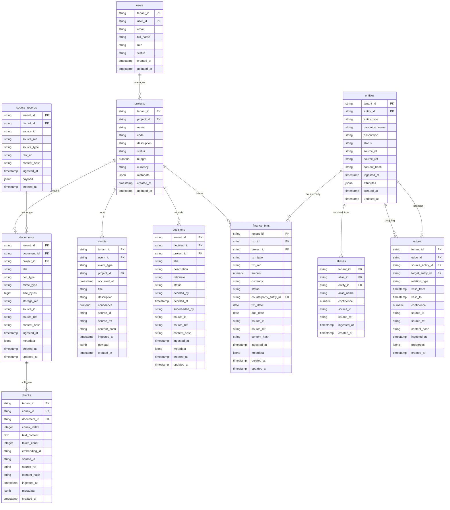

# Database Entity-Relationship Diagram (Schema v1)

> Owner task: EB-19 Database schema v1  
> Deliverables: db/migrations/0001_initial.sql, db/migrations/0001_initial.down.sql, packages/ontology/models.py, packages/ontology/graph.py  
> Multi-tenancy: Logical isolation via PostgreSQL Row-Level Security (`FORCE RLS`) with `current_setting('app.tenant_id', true)` and compound foreign keys containing `tenant_id`.

---

## 1. Visual Entity-Relationship Diagram

---

## 2. Structural Principles

### 2.1 Tenant Isolation at the Physical and Logical Level (Risk R-6)
- **Every table has `tenant_id NOT NULL`** with a format check constraint (`CHECK (tenant_id ~ '^[a-z0-9][a-z0-9-]{1,62}$')`).
- **Every table has an explicit index on `tenant_id`** (`idx_<table_name>_tenant_id`).
- **Composite Primary Keys**: Every primary key is compound `(tenant_id, <entity_id>)`, guaranteeing uniqueness per tenant.
- **Composite Foreign Keys**: All inter-table relations require matching `tenant_id` pairs (e.g. `(tenant_id, project_id) REFERENCES projects (tenant_id, project_id)`). This guarantees cross-tenant references cannot exist at the database engine level.
- **Postgres Row-Level Security**: Every table has `ENABLE ROW LEVEL SECURITY;` and `FORCE ROW LEVEL SECURITY;`, with a policy evaluating `tenant_id = current_setting('app.tenant_id', true)`.

### 2.2 Complete Provenance Tracking (Subtask 3)
Across `source_records`, `documents`, `chunks`, `entities`, `aliases`, `edges`, `events`, `decisions`, and `finance_txns`, every row captures:
1. `source_id`: The connector or integration source identifier (e.g., `whatsapp-main`, `drive-inbox`, `gmail-finance`).
2. `source_ref`: The external system identifier or URI (message ID, file URI, email thread ID).
3. `ingested_at`: High-precision timestamp when the information entered K!larity.
4. `content_hash`: Cryptographic content hash (`sha256:...`) ensuring byte-level verification and deduplication.

### 2.3 Temporal Knowledge Graph (Subtask 2)
In the `edges` table:
- `valid_from`: Timestamp when the relationship became true in the real world (defaults to `now()`).
- `valid_to`: Timestamp when the relationship expired or was superseded (`NULL` means currently valid).
- Constraint: `CHECK (valid_to IS NULL OR valid_to >= valid_from)`.
- Index: `idx_edges_temporal ON edges (tenant_id, valid_from, valid_to)` for high-speed point-in-time and historical graph queries.

### 2.4 Decision Memory & Finance
- `decisions`: Stores architectural, construction, design, and commercial decisions with structured status transitions (`proposed` -> `decided` -> `superseded` / `revoked`) and exact rationale.
- `finance_txns`: Stores invoices, payments, credit notes, and change orders with exact Decimal amounts (`numeric(15,2)`), counterparty entity links, and provenance citations.
